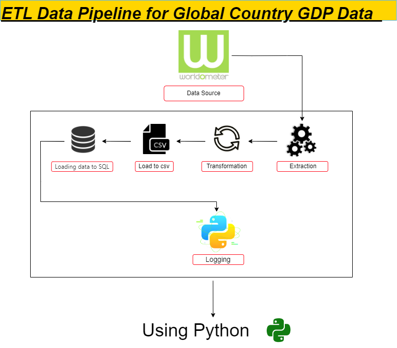

# ETL Project for Global Country GDP Data

## Project Description

The ETL (Extract, Transform, Load) project for global country GDP data is designed to fetch, process, and store GDP information for various countries from the Worldometer website. This project ensures that the data is clean, well-structured, and readily available for analysis or reporting. The project includes comprehensive logging for monitoring and debugging purposes.

## Key Components

### Extraction

**Objective**: Fetch the latest GDP data for various countries from the Worldometer website.

**Implementation**:
- Utilizes Python’s `requests` library to retrieve the HTML content of the Worldometer GDP page.
- Employs `BeautifulSoup` for parsing the HTML content and locating the relevant table using its ID or class attribute.
- Converts the extracted table into a pandas DataFrame for further processing.

**Output**: Raw data in a pandas DataFrame format.

### Transformation

**Objective**: Clean and transform the extracted data to ensure it is suitable for analysis and storage.

**Implementation**:
- Handles missing values by dropping rows containing any NaNs.
- Renames columns to improve readability and maintain consistency.
- Identifies the country with the highest population and adds this information to a new column.

**Output**: Transformed and cleaned pandas DataFrame.

### Loading

**Objective**: Store the transformed data in both CSV files and an SQLite database for persistent storage.

**Implementation**:
- Saves the DataFrame to a CSV file using pandas' `to_csv` method.
- Loads the data into an SQLite database using pandas' `to_sql` method.

**Output**: Persistently stored data in CSV and SQLite database formats.

### Logging

**Objective**: Provide detailed logs for each step of the ETL process to ensure traceability and ease of debugging.

**Implementation**:
- Utilizes Python’s `logging` library to create log entries for each major step and significant event in the ETL process.
- Logs include timestamps, messages, and error details (if any).

**Output**: Log files and console output detailing the ETL process.

## Usage

1. **Clone the Repository**:
   ```sh
   git clone https://github.com/yourusername/etl-gdp-project.git
   cd etl-gdp-project

